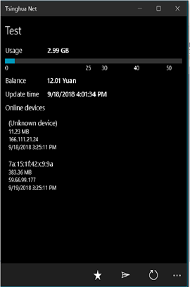
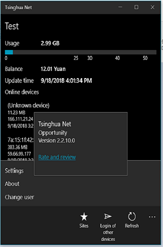

# TsinghuaNetUWP (codename)

This is my fork of [TsinghuaNet](https://github.com/OpportunityLiu/TsinghuaNet) project.

My goal is to research the "notification service" block and the "background tasks" block.

I plan to use this app's "design language" (black "metro-style" background, etc.) and "architecture patern" :) 

## Screenshots

## Few words about the original

- MS Store url: https://apps.microsoft.com/store/detail/tsinghua-net/9NBLGGGZ5Q4J

- Tsinghua Net is a third-party authentication client for Tsinghua University campus network, provides campus network login and query service, you can also use the app to fetch the e-learning services of Tsinghua.
 

## Solution structure 

- TsinghuaNet :: Main part (UWP, min. os. build 15063)
- Web :: Some Internet (Web) deals
- Settings :: App Settings
- NotificationService :: Toasts, etc.
- BackgroundLogOnTask :: Background Tasks

## .

AS IS. No support. RnD only.

## ..

[m][e] 2022

